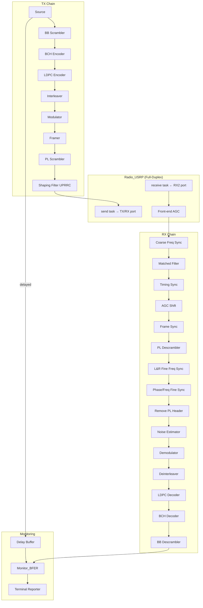

# Design Document: DVB-S2 Loopback Binary

## Overview

The `dvbs2_loopback` binary provides a full-duplex DVB-S2 hardware-in-the-loop test capability using a single Ettus B200-mini SDR. It transmits DVB-S2 encoded IQ samples from the TX/RX port and simultaneously receives them on the RX2 port (through a physical cable + attenuator), then decodes and measures BER/FER performance.

The design reuses all existing module construction via `factory::DVBS2` and the `Radio_USRP` module's simultaneous TX+RX capability. The key architectural difference from `dvbs2_tx_rx` is the removal of all simulated channel impairments (AWGN, frequency shift, fading, fractional/integer delay) and their replacement with a single `Radio_USRP` instance operating in full-duplex mode.

The binary follows the same waiting/learning phase pattern as `dvbs2_rx` to allow synchronizer acquisition on the real received signal before BER/FER counting begins.

## Architecture



The TX and RX chains share a single `Radio_USRP` instance. When `--rad-threaded` is specified, the radio uses internal FIFO-based threads for TX and RX streaming, decoupling the StreamPU sequence execution from USB transfer timing.

## Components and Interfaces

### Main Binary: `src/mains/LOOPBACK/main.cpp`

The main function follows this structure:

1. **Signal handler registration** — `spu::tools::Signal_handler::init()`
2. **CLI parsing** — `factory::DVBS2(argc, argv)` (reuses existing factory)
3. **UHD guard** — `#ifndef DVBS2_LINK_UHD` / `#error` to prevent compilation without UHD
4. **Tool construction** — Constellation, BCH polynomial generator, interleaver core
5. **Module construction** — All TX/RX modules via `factory::DVBS2::build_*()` methods, plus one `Radio_USRP` with both TX and RX enabled
6. **Socket binding** — TX chain → radio send, radio receive → RX chain, source → delay → monitor
7. **Waiting/Learning phases** — Synchronizer acquisition using `sync_step_mf` and `feedbr`
8. **Steady-state execution** — Full sequence with BER/FER counting
9. **Shutdown** — Signal-driven graceful stop

### Module Construction

All modules are constructed identically to `dvbs2_tx_rx` except:

| Module | dvbs2_tx_rx | dvbs2_loopback |
|--------|-------------|----------------|
| `Channel` | Yes (AWGN) | **No** |
| `freq_shift` | Yes (simulated CFO) | **No** |
| `fad_mlt` | Yes (fading) | **No** |
| `chn_frac_del` | Yes (fractional delay) | **No** |
| `chn_int_del` | Yes (integer delay) | **No** |
| `chn_frm_del` | Yes (frame delay) | **No** |
| `Radio_USRP` | No | **Yes** (full-duplex) |
| `front_agc` | No | **Yes** (front-end AGC before coarse sync) |

The `front_agc` module (same as in `dvbs2_rx`) is needed because real RF samples have arbitrary amplitude, unlike the simulated channel which has controlled power levels.

### Radio Configuration

The single `Radio_USRP` instance requires:
- `rx_enabled = true` (set by `--rad-rx-rate`)
- `tx_enabled = true` (set by `--rad-tx-rate`)
- TX antenna = `"TX/RX"` (default in factory)
- RX antenna = `"RX2"` (default in factory)
- `threaded = true` recommended for full-duplex to prevent TX starvation

The factory's `Radio::store()` method already enables TX/RX based on the presence of `--rad-tx-rate` and `--rad-rx-rate` arguments.

### Socket Binding (Steady-State)

**TX path:**
```
source → bb_scrambler → BCH_encoder → LDPC_encoder → itl_tx → modem(modulate) → framer(generate) → pl_scrambler(scramble) → shaping_flt → radio(send)
```

**RX path:**
```
radio(receive) → front_agc → sync_coarse_f → matched_flt → sync_timing → mult_agc → sync_frame → pl_scrambler(descramble) → sync_fine_lr → sync_fine_pf → framer(remove_plh) → estimator → modem(demodulate) → itl_rx → LDPC_decoder → BCH_decoder → bb_descrambler
```

**Monitor path:**
```
source → delay → monitor(check_errors2::U)
bb_descrambler → monitor(check_errors2::V)
```

### Waiting/Learning Phase Implementation

The waiting and learning phases follow the same pattern as `dvbs2_tx_rx` and `dvbs2_rx`:

**Waiting Phase:**
- Uses `sync_step_mf` (combined coarse freq + matched filter + timing in one step) instead of separate `sync_coarse_f → matched_flt → sync_timing` chain
- Includes `feedbr` (feedbacker) to feed frame sync delay back into `sync_step_mf`
- TX source is included in `firsts_wl12` so transmission continues during waiting
- Sequence executes until `sync_frame->get_packet_flag()` returns true
- PLL coefficients set to `(1, 1/sqrt(2), 1e-4)` for wide acquisition bandwidth

**Learning Phase 1 (150 frames):**
- Same sequence as waiting phase
- PLL coefficients: `(1, 1/sqrt(2), 1e-4)`
- Progressively accumulates synchronizer state

**Learning Phase 2 (150 frames):**
- PLL coefficients tightened to `(1, 1/sqrt(2), 5e-5)`
- Continues building synchronizer accuracy

**Learning Phase 3 (200 frames):**
- Switches back to standard `sync_coarse_f → matched_flt → sync_timing` chain
- Runs the full RX decode chain (up to `sync_fine_pf`) without BER counting
- Allows fine frequency synchronizer to converge

**Transition to Steady-State:**
- `monitor->reset()` clears any counts accumulated during learning
- `delay->set_delay(delay_tx_rx)` accounts for frames consumed during waiting/learning
- `sync_timing->set_act(true)` enables timing update tracking
- Full sequence executes with BER/FER counting active

### StreamPU Sequence Configuration

For the loopback binary, a single `spu::runtime::Sequence` is used (not a multi-stage pipeline) to keep the implementation straightforward. The sequence `firsts_t` vector contains:

```cpp
const std::vector<spu::runtime::Task*> firsts_t = {
    &(*source)[spu::module::src::tsk::generate],  // TX source (independent)
    &(*radio)[rad::tsk::receive]                   // RX receive (independent)
};
```

Both tasks are independent first-stage entries, meaning:
- The source generates frames and the TX chain processes them to the radio send task
- The radio receive task pulls samples and the RX chain processes them to the monitor
- When `--rad-threaded` is used, the radio's internal FIFO threads decouple USB timing from sequence execution, ensuring TX is never starved by RX processing latency

The `monitor->disable_is_done(true)` call prevents the sequence from auto-terminating based on frame count, enabling continuous operation.

### Signal Handling and Graceful Shutdown

```cpp
spu::tools::Signal_handler::init();
```

This registers handlers for SIGINT and SIGTERM that set an internal flag. The sequence execution loop checks this flag. On shutdown:

1. The sequence `exec()` loop returns
2. `radio_usrp->cancel_waiting()` is called to unblock any pending FIFO waits
3. The radio destructor stops USB streams and joins background threads
4. Terminal displays final statistics

## Data Models

### Key Parameters (from `factory::DVBS2`)

| Parameter | Purpose | Source |
|-----------|---------|--------|
| `p_rad.rx_rate` | RX sample rate | `--rad-rx-rate` |
| `p_rad.tx_rate` | TX sample rate | `--rad-tx-rate` |
| `p_rad.rx_freq` / `tx_freq` | Center frequency | `--rad-rx-freq` / `--rad-tx-freq` |
| `p_rad.rx_gain` / `tx_gain` | RF gain | `--rad-rx-gain` / `--rad-tx-gain` |
| `p_rad.threaded` | FIFO threading | `--rad-threaded` |
| `p_rad.serial` | B200 serial | `--rad-serial` |
| `overall_delay` | Pipeline delay for BER alignment | Computed from MODCOD |
| `K_bch` | Information bits per frame | From MODCOD |
| `N_ldpc` | LDPC codeword length (16200) | Constant |
| `pl_frame_size` | PL frame size in symbols | From MODCOD |

### Runtime State

| Variable | Type | Purpose |
|----------|------|---------|
| `delay_tx_rx` | `int` | Running count of pipeline delay, incremented during waiting/learning aborts |
| `m` | `unsigned` | Frame counter for phase transitions |
| `stop_threads` | `atomic<bool>` | Radio shutdown flag |

## Error Handling

| Error Condition | Handling |
|-----------------|----------|
| B200-mini not found on USB | `Radio_USRP` constructor throws `runtime_error` with diagnostic message |
| USB disconnection during operation | `Radio_USRP` detects consecutive timeouts or bad packets, sets `stop_threads=true` |
| RX overflow (USB bandwidth exceeded) | Logged via UHD, `OVF` flag propagated to probes |
| Sequence abort during waiting phase | `delay_tx_rx` incremented by `n_frames`, sequence restarts next iteration |
| SIGINT/SIGTERM received | Graceful shutdown via `cancel_waiting()` and sequence termination |
| `DVBS2_LINK_UHD` not defined | Compile-time `#error` prevents building without UHD support |
| Invalid radio parameters (rate > 56 MHz, etc.) | `Radio::validate()` throws at parameter parsing time |

## Testing Strategy

### Why Property-Based Testing Does Not Apply

This feature is primarily about **infrastructure wiring** — connecting existing, already-tested modules in a new configuration. The acceptance criteria are:
- Structural checks (correct socket bindings, correct module construction)
- Configuration pass-through (CLI → factory → modules)
- State machine transitions (waiting → learning → steady-state)
- Build system integration (CMakeLists.txt)
- Absence checks (no simulated channel modules)

None of these have meaningful input variation that would benefit from property-based testing with 100+ iterations. The individual modules (encoders, decoders, synchronizers, Radio_USRP) are already independently tested. The loopback binary's correctness is about composing them correctly.

### Unit Tests

| Test | What It Verifies |
|------|------------------|
| `test_loopback_no_channel_modules` | Verifies no Channel, freq_shift, fad_mlt, delay modules are constructed |
| `test_loopback_radio_full_duplex` | Verifies Radio_USRP is constructed with both `tx_enabled` and `rx_enabled` |
| `test_loopback_uhd_required` | Verifies `#error` directive when `DVBS2_LINK_UHD` is not defined |
| `test_loopback_monitor_is_done_disabled` | Verifies `disable_is_done(true)` is called |
| `test_loopback_delay_alignment` | Verifies delay buffer uses `overall_delay` parameter |

### Integration Tests

| Test | What It Verifies |
|------|------------------|
| `test_loopback_compile_and_link` | Binary compiles and links without errors |
| `test_loopback_cli_parsing` | All documented CLI args are accepted without error |
| `test_loopback_waiting_phase_transition` | Frame sync `packet_flag` triggers learning phase entry |
| `test_loopback_pll_coefficient_progression` | PLL coefficients tighten across learning sub-phases |

### Hardware Integration Test (Manual)

The primary validation of this binary is a hardware cable-loopback test:
1. Connect TX/RX port → 30dB attenuator → RX2 port
2. Run: `dvbs2_loopback --rad-threaded --rad-rx-rate 2e6 --rad-tx-rate 2e6 --rad-rx-freq 1090e6 --rad-tx-freq 1090e6 --rad-rx-gain 40 --rad-tx-gain 50 --mod-cod QPSK-S_8/9`
3. Verify: BER converges to 0 (or near 0) after learning phase completes
4. Verify: No overflows reported at the chosen sample rate
5. Verify: Ctrl+C triggers clean shutdown with final statistics displayed

### Build System Test

Verify in CMakeLists.txt:
- `dvbs2_loopback` target exists with source at `src/mains/LOOPBACK/main.cpp`
- Links against `dvbs2_common` and `aff3ct-static-lib`
- Includes `src/common` directory
